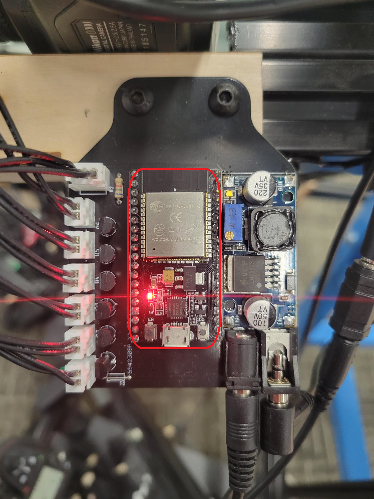
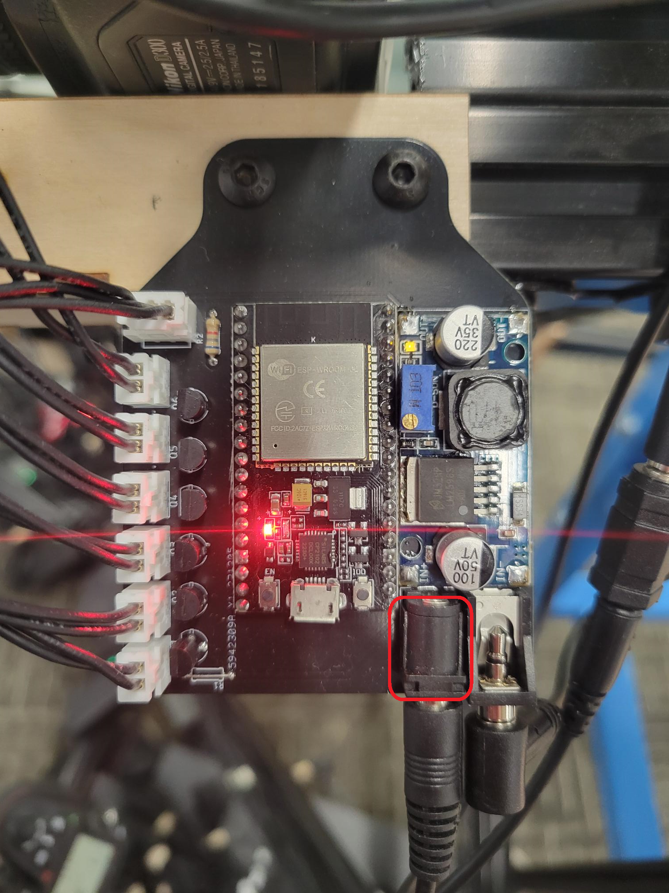

# Ringlight Controller README

Welcome to the Ringlight Controller documentation! This guide will help you understand how the ringlight controller board works, even if you're not a programmer or electrical engineer. We'll break down the components, their functions, and the overall operation in a simple and organized manner.

## Table of Contents

1. **Introduction**
2. **Components**
3. **Power Supply**
4. **ESP32 Microcontroller**
5. **RGB LED Strip**
6. **Operation**

## 1. Introduction

The Ringlight Controller is a device designed to control a ringlight, which is often used for photography and video lighting. This controller is built around an ESP32 microcontroller and is capable of turning on and off the ringlight's LEDs in sync with a shutter signal.

###### Design Choices
This project from the start was meant to be done
* as fast as possible
* as simple as possible
* as robust as possible (i.e. can be easily improved upon later)

This means that there are potentially lots of optimizations that could be made, as I chose parts I am most familiar with and think that most people will find easy to use. Below I will provide a brief description of how the board works, piece by piece.

## 2. Components

#### 2.1 Mosfets (6)

- These are electronic switches that control the flow of electrical current. There are six of them on the board (circled in red below)

#### 2.2 Buck Converter

- This component steps down the input voltage from 24V to 5V. It provides power to both the ESP32 and the 3-pin RGB LED strip (not the 2-pin white leds, those need the full 24V). I refer to the entire blue PCB as one component - the buck converter. These can be bought for under a dollar at the BYU ECE shop (Northeast corner of the 4th floor of the Clyde building) or online. You can tune the output voltage using a small flat screwdriver. I have tuned them to output 5V, which can be checked using a handheld voltmeter.

#### 2.3 ESP32

The ESP32 is the heart of the controller. It performs the following tasks:

- **Detect Shutter Signal:** The ESP32 listens for a shutter signal coming from a 3.5mm headphone jack on the board. This signal tells the controller when to turn on the ringlight.

- **Control Mosfets:** When the shutter signal is detected, the ESP32 sends a signal to the Mosfets to turn them on. This allows the 24V power to flow to the white LED banks.

- **Control RGB LEDs** The ESP32 uses just one pin to control all 24 RGB LEDs of the ringlight. There are a couple of libraries you can use in the Arduino IDE to control them, with NEOpixel being arguably the easiest.
- For its dimensions and pinout, go [here.](https://docs.ai-thinker.com/en/esp32/boards/nodemcu_32s) Don't worry about anything else on that page, we program it using the Arduino IDE, which is much simpler than the process described by the manufacturer.

#### 2.4 JST connectors (6, 2-pins)

- Each of these go to a bank of 6 LEDs on the ringlight board that is mounted to a camera.

  
#### 2.5 JST connector (1, 3-pin)

- The three pins are ground, data, and power (5V). They go to the individually addressable RGB LEDs on the ringlight.

  
#### 2.6 3.5mm Jack

- Gets the signal from the camera

#### 2.7 Barrel Jack

- Gets power to the buck converter and ESP32

## 3. Supplying Power

The board expects an input of 24 Volts throught a **_center-positive_** DC barrel jack. You can check to see if your power source is center-positive by placing the red probe of a volt meter in the center of the plug and the black probe on the sleeve. If the number is positive you are all good. (This is important as there is no standard and center-negative is quite common too). The power supplies we are using for the photogrammetry rig are center-positive, so if you are a Makerspace employee reading this, no need to worry about this.
Again, here's how the power flows through the board:
- The 24V power goes into the board.
- A Buck Converter steps down the voltage to 5V.
- The 5V output powers both the ESP32 and the RGB LED strip.

## 6. Operation

Here's how the Ringlight Controller operates in simple terms:

1. **Power Supply:** Connect a 24V power source to the board.

2. **Shutter Signal:** Connect a device (e.g., a camera) to the 3.5mm headphone jack on the board. When you trigger the camera's shutter, it sends a signal to the board.

3. **ESP32 Activation:** The ESP32 detects the shutter signal and activates the Mosfets.

4. **Mosfet Activation:** The Mosfets turn on, allowing the 24V power to flow to the LED banks in the ringlight.

5. **Ringlight Illumination:** The ringlight's LEDs turn on, providing the desired lighting for your photography or video.

# WARNING!!!

- NEVER PLUG ANYTHING INTO THE MICROUSB IF THE BOARD IS BEING POWERED BY THE 24V BARREL JACK. IT WILL DESTROY THE ESP32 AND MAYBE THE COMPUTER PORT
- If/When you reprogram the board, make 100% sure that the 24V is unplugged. The board will power up from just the usb, but the ringlights won't light up, and that is fine. 

That's it! You now have a basic understanding of how the Ringlight Controller works.
